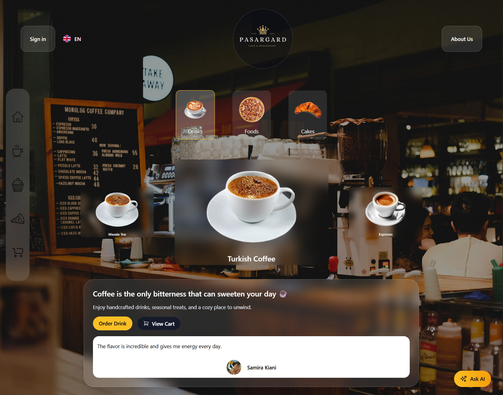
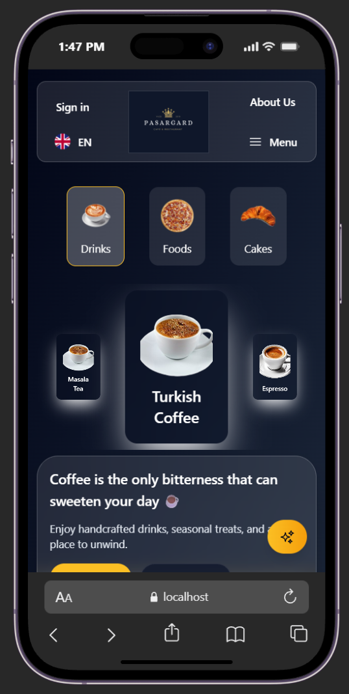
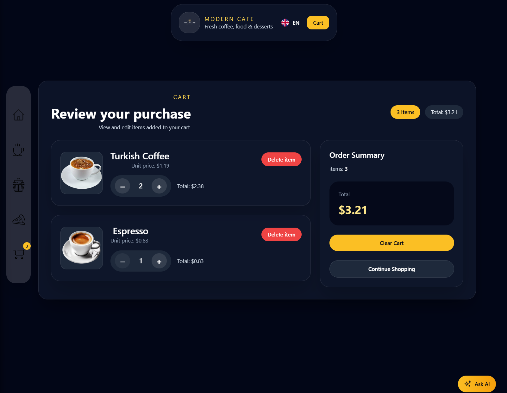
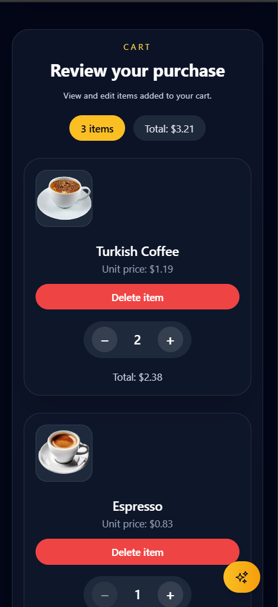

# RyanCafe

A modern coffee shop frontend application built with React, TypeScript, Tailwind CSS, and Redux Toolkit.

## 🌐 Live Demo

☕ Visit the deployed version:
[Ryan Cafe](https://ryan-cafe.vercel.app)

## 💻 Source Code

https://github.com/Ryanch98/ryan-cafe

## Features

- ☕ Modern coffee shop landing page
- 🤖 AI coffee assistant for customer questions
- 🛒 Shopping cart with Redux Toolkit state management
- 📱 Fully responsive design for all screen sizes
- 📲 Progressive Web App (PWA) support for installable experience
- 🌍 Multi-language support
- 🍵 Interactive menu with category filtering
- 🎨 Smooth animations using Framer Motion

## 📸 Screenshots

### Home Page




### Shopping Cart




## Technologies Used

- React
- TypeScript
- Tailwind CSS
- Redux Toolkit
- React Router DOM
- Framer Motion
- Swiper

## Getting Started

### Prerequisites

Make sure you have Node.js and Yarn installed.

````bash
node -v
yarn -v

### Install

```bash
git clone https://github.com/Ryanch98/ModernCafeWeb.git
cd ModernCafeWeb
yarn install
````

### Run locally

```bash
yarn start
```

Open http://localhost:3000 to view the app in your browser.

### Build for production

```bash
yarn build
```

## Project Structure

- `public/` — static HTML and manifest files
- `src/` — main React application source
- `src/Components/` — reusable UI components
- `src/Pages/` — page views and routes
- `src/redux/` — app state, slices, and store
- `src/utils/` — utility helpers
- `src/hooks/` — custom React hooks
- `src/constants/` — constant values and translations
- `src/services/` — app services and assistant logic
- `tailwind.config.js` — Tailwind CSS configuration

## License

This project is open-source and available under the MIT License.
